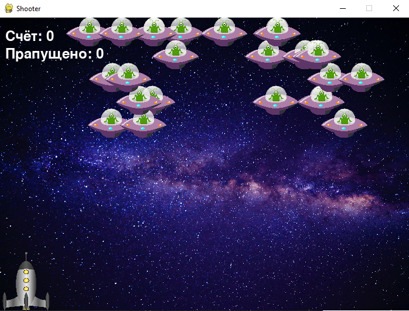
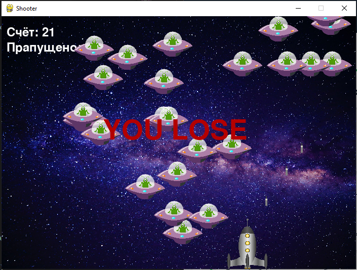

# Space Invaders
------------------------
По жанру Space Invaders — игрок управляет лазерной пушкой, передвигая её горизонтально, в нижней части экрана, а также отстреливая инопланетян, надвигающихся сверху экрана. Целью игры является уничтожение инопланетян, которые двигаются горизонтально, по направлению к низу экрана. Игрок имеет бесконечное количество патронов. Попадая в инопланетянина, игрок уничтожает его, за что получает очки.

Игрок проигрывает тогда когда поропускает 5 инопланетян либо когда задевает инопланетян.

А выйгрывает когда сбивает 15 инопланетян.

УПРАВЛЕНИЕ:
==========

Стрельба - пробел

Движение в лево - левая стрелка

Движение в право - правая стрелка

